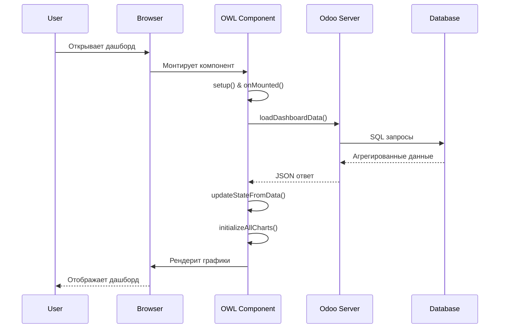

# 📂 Структура кода Amanat Dashboard

## 📄 Файлы и их назначение

### 1. Backend файлы

#### `/models/dashboard.py`
```python
class AmanatDashboard(models.Model):
    _name = 'amanat.dashboard'
    _description = 'Дашборд модуля Amanat'
```

**Основные методы:**

##### `_compute_transfer_stats(self)`
```python
def _compute_transfer_stats(self):
    """Вычисляет статистику по переводам"""
    for record in self:
        transfers = self.env['amanat.transfer'].search([])
        record.total_transfers = len(transfers)
        record.active_transfers = len(transfers.filtered(lambda t: t.state == 'open'))
        record.closed_transfers = len(transfers.filtered(lambda t: t.state == 'close'))
```

##### `get_dashboard_data(self, date_from=None, date_to=None)`
```python
@api.model
def get_dashboard_data(self, date_from=None, date_to=None):
    """
    Главный метод для получения данных дашборда
    
    Args:
        date_from (str): Начальная дата в формате YYYY-MM-DD
        date_to (str): Конечная дата в формате YYYY-MM-DD
        
    Returns:
        dict: Словарь со всеми метриками дашборда
    """
```

**Структура возвращаемых данных:**
```python
{
    # Переводы
    'transfers_count': 150,
    'transfers_active': 45,
    'transfers_closed': 105,
    'transfers_amount': 1500000.00,
    'transfers_by_status': {
        'open': 45,
        'close': 105,
        'cancel': 0
    },
    'transfers_by_currency': {
        'rub': 80,
        'usd': 50,
        'euro': 20
    },
    'transfers_by_month': [
        {'month': '2025-01', 'count': 25},
        {'month': '2025-02', 'count': 30},
        # ...
    ],
    
    # Ордера
    'orders_count': 200,
    'orders_draft': 50,
    'orders_done': 150,
    'orders_by_status': {
        'draft': 50,
        'confirmed': 30,
        'done': 120
    },
    
    # Деньги
    'money_containers_count': 500,
    'money_containers_positive': 300,
    'money_containers_debt': 200,
    
    # Валюты
    'currency_rub': 5000000.00,
    'currency_usd': 100000.00,
    'currency_usdt': 50000.00,
    'currency_euro': 80000.00,
    'currency_cny': 200000.00,
    
    # Аналитика
    'top_contragents': [
        {'name': 'ООО Компания', 'count': 25},
        # ...
    ],
    'top_payers': [
        {'name': 'Иванов И.И.', 'amount': 500000},
        # ...
    ],
    'managers_efficiency': [
        {'name': 'Петров П.П.', 'processed': 150},
        # ...
    ],
    
    # Динамика
    'transfers_dynamics': [
        {'date': '2025-01-01', 'count': 5},
        # ...
    ],
    'orders_dynamics': [
        {'date': '2025-01-01', 'count': 8},
        # ...
    ],
    
    # Прочее
    'weekday_load': {
        '0': 15,  # Воскресенье
        '1': 45,  # Понедельник
        # ...
    },
    'processing_time': [
        {'type': 'transfer', 'hours': 2.5},
        {'type': 'order', 'hours': 1.8}
    ],
    'recent_operations': [
        {
            'type': 'Перевод',
            'date': '02.01.2025',
            'amount': 50000,
            'currency': 'RUB',
            'status': 'Активен'
        },
        # ...
    ]
}
```

### 2. Frontend файлы

#### `/static/src/js/amanat_dashboard.js`

**Структура компонента:**

```javascript
export class AmanatDashboard extends Component {
    static template = "amanat.AmanatDashboard";
    static props = {};
    
    setup() {
        // Инициализация сервисов
        this.orm = useService("orm");
        this.actionService = useService("action");
        
        // Состояние компонента
        this.state = useState({
            isLoading: true,
            transfers: { /* ... */ },
            orders: { /* ... */ },
            money: { /* ... */ },
            currencies: { /* ... */ },
            // ...
        });
        
        // Хранилище для Chart.js инстансов
        this.charts = {};
        
        // Хуки жизненного цикла
        onMounted(async () => { /* ... */ });
        onWillUnmount(() => { /* ... */ });
    }
}
```

**Основные методы компонента:**

##### Загрузка данных
```javascript
async loadDashboardData() {
    this.state.isLoading = true;
    try {
        const params = {};
        
        // Добавляем фильтры если указаны
        if (this.state.dateRange1.start) {
            params.date_from = this.state.dateRange1.start;
        }
        if (this.state.dateRange1.end) {
            params.date_to = this.state.dateRange1.end;
        }
        
        // Вызов backend метода
        const data = await this.orm.call(
            'amanat.dashboard',
            'get_dashboard_data',
            [],
            params
        );
        
        // Обновление состояния
        this.updateStateFromData(data);
        
        // Рендеринг графиков
        setTimeout(() => this.initializeAllCharts(), 100);
    } catch (error) {
        console.error('Error loading dashboard data:', error);
    } finally {
        this.state.isLoading = false;
    }
}
```

##### Обновление состояния
```javascript
updateStateFromData(data) {
    if (data) {
        // Обновляем все части состояния
        this.state.transfers = {
            total: data.transfers_count || 0,
            active: data.transfers_active || 0,
            closed: data.transfers_closed || 0,
            amount: data.transfers_amount || 0,
            byStatus: data.transfers_by_status || {},
            byCurrency: data.transfers_by_currency || {},
            byMonth: data.transfers_by_month || [],
            byCountry: data.transfers_by_country || {},
            byType: data.transfers_by_type || {}
        };
        
        this.state.orders = {
            total: data.orders_count || 0,
            draft: data.orders_draft || 0,
            done: data.orders_done || 0,
            byStatus: data.orders_by_status || {},
            byMonth: data.orders_by_month || []
        };
        
        // ... и так далее для всех метрик
    }
}
```

##### Рендеринг графиков
```javascript
renderPieChartWithPercentage(canvasId, config) {
    const canvas = document.getElementById(canvasId);
    if (!canvas) return;
    
    // Уничтожаем старый график если есть
    if (this.charts[canvasId]) {
        this.charts[canvasId].destroy();
    }
    
    const total = config.data.reduce((sum, value) => sum + value, 0);
    
    const chartConfig = {
        type: 'pie',
        data: {
            labels: config.labels,
            datasets: [{
                data: config.data,
                backgroundColor: [
                    'rgba(255, 99, 132, 0.8)',
                    'rgba(54, 162, 235, 0.8)',
                    'rgba(255, 206, 86, 0.8)',
                    'rgba(75, 192, 192, 0.8)',
                    'rgba(153, 102, 255, 0.8)'
                ],
                borderColor: [/* ... */],
                borderWidth: 1
            }]
        },
        options: {
            responsive: true,
            maintainAspectRatio: true,
            plugins: {
                title: {
                    display: true,
                    text: config.title
                },
                legend: {
                    position: 'bottom'
                },
                tooltip: {
                    callbacks: {
                        label: function(context) {
                            const label = context.label || '';
                            const value = context.parsed;
                            const percentage = total > 0 ? 
                                ((value / total) * 100).toFixed(1) : 0;
                            return `${label}: ${value} (${percentage}%)`;
                        }
                    }
                }
            }
        }
    };
    
    // Добавляем плагин для отображения процентов если он загружен
    if (typeof ChartDataLabels !== 'undefined') {
        chartConfig.options.plugins.datalabels = {
            formatter: (value, ctx) => {
                const percentage = total > 0 ? 
                    ((value / total) * 100).toFixed(1) : 0;
                return percentage > 5 ? `${percentage}%` : '';
            },
            color: '#fff',
            font: {
                weight: 'bold',
                size: 12
            }
        };
    }
    
    // Создаем новый график
    this.charts[canvasId] = new Chart(canvas, chartConfig);
}
```

### 3. Шаблоны

#### `/static/src/xml/amanat_dashboard.xml`

**Структура шаблона:**

```xml
<templates id="template" xml:space="preserve">
<t t-name="amanat.AmanatDashboard" owl="1">
    <div class="o_amanat_dashboard">
        <!-- Загрузка -->
        <div t-if="state.isLoading" class="o_dashboard_loading">
            <div class="text-center p-5">
                <i class="fa fa-spinner fa-spin fa-3x text-primary"/>
                <h3 class="mt-3">Загрузка дашборда...</h3>
            </div>
        </div>
        
        <!-- Основной контент -->
        <div t-else="" class="o_dashboard_content">
            <!-- Заголовок -->
            <div class="dashboard-header">
                <h1>📊 Аналитический дашборд Amanat</h1>
                <!-- Фильтры по датам -->
            </div>
            
            <!-- Метрики -->
            <div class="dashboard-metrics">
                <div class="row">
                    <div class="col-lg-3 col-md-6">
                        <div class="metric-card transfers">
                            <h3>Переводы</h3>
                            <div class="metric-value">
                                <t t-esc="formatNumber(state.transfers.total)"/>
                            </div>
                            <!-- Детали -->
                        </div>
                    </div>
                    <!-- Другие метрики -->
                </div>
            </div>
            
            <!-- Графики -->
            <div class="dashboard-charts">
                <div class="row">
                    <div class="col-md-6">
                        <div class="chart-container">
                            <canvas id="transfers-status-pie"/>
                        </div>
                    </div>
                    <!-- Другие графики -->
                </div>
            </div>
        </div>
    </div>
</t>
</templates>
```

### 4. Стили

#### `/static/src/css/amanat_dashboard.css`

**Основные классы:**

```css
/* Контейнер дашборда */
.o_amanat_dashboard {
    background-color: #1a1a1a;
    color: #ffffff;
    min-height: 100vh;
    padding: 20px;
}

/* Метрики */
.metric-card {
    background: rgba(255, 255, 255, 0.05);
    border: 1px solid rgba(255, 255, 255, 0.1);
    border-radius: 12px;
    padding: 20px;
    margin-bottom: 20px;
    transition: all 0.3s ease;
}

.metric-card:hover {
    transform: translateY(-5px);
    box-shadow: 0 10px 30px rgba(0, 0, 0, 0.3);
}

/* Графики */
.chart-container {
    position: relative;
    height: 300px;
    margin-bottom: 30px;
    background: rgba(0, 0, 0, 0.3);
    border-radius: 8px;
    padding: 15px;
}

.chart-container canvas {
    max-height: 100%;
    min-height: 250px;
}

/* Адаптивность */
@media (max-width: 768px) {
    .metric-card {
        margin-bottom: 15px;
    }
    
    .chart-container {
        height: 250px;
    }
}
```

### 5. Конфигурация

#### `/__manifest__.py`

```python
{
    'name': 'Amanat',
    'version': '1.0.0',
    'depends': ['base', 'web'],
    'data': [
        # Security
        'security/ir.model.access.csv',
        
        # Data
        'data/dashboard_data.xml',
        
        # Views
        'views/dashboard_views.xml',
        'views/menu.xml',
    ],
    'assets': {
        'web.assets_backend': [
            'amanat/static/src/js/amanat_dashboard.js',
            'amanat/static/src/xml/amanat_dashboard.xml',
            'amanat/static/src/css/amanat_dashboard.css',
        ],
    },
}
```

## 🔄 Поток данных



## 🎯 Точки расширения

### 1. Добавление новой метрики

**Backend:**
```python
# В методе get_dashboard_data
new_metric = self.env['amanat.new_model'].search_count(domain)
result['new_metric'] = new_metric
```

**Frontend:**
```javascript
// В updateStateFromData
this.state.newMetric = data.new_metric || 0;

// В шаблоне
<div class="metric-value">
    <t t-esc="state.newMetric"/>
</div>
```

### 2. Новый тип графика

```javascript
renderRadarChart(canvasId, config) {
    const canvas = document.getElementById(canvasId);
    if (!canvas) return;
    
    this.charts[canvasId] = new Chart(canvas, {
        type: 'radar',
        data: config.data,
        options: config.options
    });
}
```

### 3. Кастомные фильтры

```javascript
// Добавить в state
this.state.customFilter = {
    manager: null,
    department: null
};

// Обработчик изменения
onCustomFilterChange(field, value) {
    this.state.customFilter[field] = value;
    this.loadDashboardData();
}
```

---

*Эта документация описывает внутреннюю структуру кода Amanat Dashboard* 