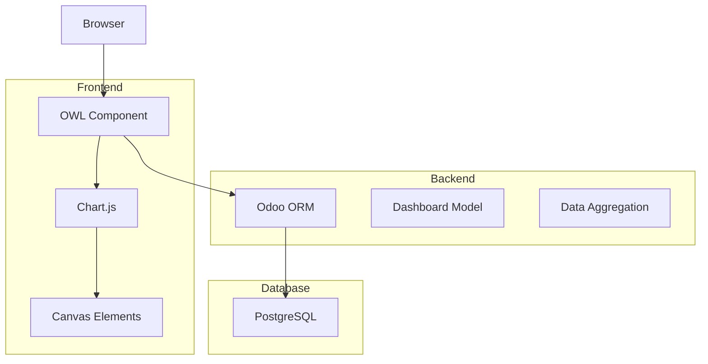

# 📊 Полное руководство по Amanat Dashboard

## 📋 Содержание

1. [Обзор решения](#обзор-решения)
2. [Архитектура](#архитектура)
3. [Технологический стек](#технологический-стек)
4. [Структура файлов](#структура-файлов)
5. [Компоненты системы](#компоненты-системы)
6. [Установка и настройка](#установка-и-настройка)
7. [Разработка и расширение](#разработка-и-расширение)
8. [API и методы](#api-и-методы)
9. [Решение проблем](#решение-проблем)
10. [Лучшие практики](#лучшие-практики)

---

## 🎯 Обзор решения

Amanat Dashboard - это современная система аналитики и визуализации данных для модуля Amanat в Odoo 18. Dashboard предоставляет реал-тайм отображение ключевых бизнес-метрик через интерактивные графики и виджеты.

### Ключевые возможности:
- 📈 18+ типов графиков (круговые, линейные, столбчатые)
- 🔄 Реал-тайм обновление данных
- 📅 Фильтрация по датам с возможностью сравнения периодов
- 💱 Мультивалютная аналитика
- 📱 Адаптивный дизайн для всех устройств
- 🌙 Тёмная тема

---

## 🏗️ Архитектура

### Общая схема



### Компонентная архитектура

```
┌─────────────────────────────────────────┐
│           Amanat Dashboard              │
├─────────────────────────────────────────┤
│  Frontend (OWL + Chart.js)              │
│  ├── AmanatDashboard Component          │
│  ├── Chart Renderers                    │
│  └── State Management                   │
├─────────────────────────────────────────┤
│  Backend (Python)                       │
│  ├── Dashboard Model                    │
│  ├── Data Aggregation Methods          │
│  └── API Endpoints                      │
├─────────────────────────────────────────┤
│  Database (PostgreSQL)                  │
│  └── Aggregated Queries                 │
└─────────────────────────────────────────┘
```

---

## 🛠️ Технологический стек

### Frontend
- **OWL (Odoo Web Library)** - Реактивный фреймворк для веб-компонентов
- **Chart.js 4.4.0** - Библиотека для создания графиков
- **Chart.js DataLabels Plugin** - Плагин для отображения значений на графиках
- **Bootstrap 5** - CSS фреймворк (встроен в Odoo)
- **JavaScript ES6+** - Современный JavaScript

### Backend
- **Python 3.11** - Основной язык
- **Odoo 18 Framework** - Платформа
- **PostgreSQL** - База данных

### Инструменты разработки
- **VS Code** - Рекомендуемый редактор
- **Chrome DevTools** - Отладка frontend
- **Odoo Debug Mode** - Отладка backend

---

## 📁 Структура файлов

```
addons/amanat/
├── models/
│   └── dashboard.py                 # Модель дашборда и бизнес-логика
├── views/
│   ├── dashboard_views.xml          # XML представления
│   └── menu.xml                     # Пункты меню
├── static/
│   └── src/
│       ├── js/
│       │   └── amanat_dashboard.js  # OWL компонент
│       ├── xml/
│       │   └── amanat_dashboard.xml # Шаблон компонента
│       └── css/
│           └── amanat_dashboard.css # Стили
├── data/
│   └── dashboard_data.xml           # Начальные данные
├── security/
│   └── ir.model.access.csv          # Права доступа
└── __manifest__.py                  # Манифест модуля
```

---

## 🧩 Компоненты системы

### 1. Backend Model (dashboard.py)

```python
class AmanatDashboard(models.Model):
    _name = 'amanat.dashboard'
    _description = 'Дашборд модуля Amanat'
```

**Основные поля:**
- Счетчики (total_transfers, active_transfers, etc.)
- Суммы по валютам (total_rub_balance, total_usd_balance, etc.)
- Показатели эффективности (transfers_completion_rate)

**Ключевой метод:**
```python
@api.model
def get_dashboard_data(self, date_from=None, date_to=None):
    """Получить агрегированные данные для дашборда"""
```

### 2. Frontend Component (amanat_dashboard.js)

```javascript
export class AmanatDashboard extends Component {
    static template = "amanat.AmanatDashboard";
    static props = {};
}
```

**Основные методы:**
- `loadDashboardData()` - Загрузка данных с сервера
- `initializeAllCharts()` - Инициализация всех графиков
- `renderPieChartWithPercentage()` - Рендеринг круговых диаграмм
- `renderLineChart()` - Рендеринг линейных графиков
- `renderBarChart()` - Рендеринг столбчатых диаграмм

### 3. Шаблон (amanat_dashboard.xml)

Структура шаблона:
```xml
<t t-name="amanat.AmanatDashboard" owl="1">
    <div class="o_amanat_dashboard">
        <!-- Заголовок и фильтры -->
        <!-- Метрики -->
        <!-- Графики -->
    </div>
</t>
```

---

## ⚙️ Установка и настройка

### 1. Предварительные требования
- Odoo 18
- PostgreSQL 13+
- Python 3.11+
- Модуль Amanat установлен и настроен

### 2. Установка

```bash
# 1. Скопируйте файлы в папку addons/amanat
# 2. Обновите модуль
./odoo-bin -c odoo.conf -u amanat -d mydb

# Или через интерфейс:
# Приложения → Amanat → Обновить
```

### 3. Настройка прав доступа

В файле `security/ir.model.access.csv`:
```csv
id,name,model_id:id,group_id:id,perm_read,perm_write,perm_create,perm_unlink
access_amanat_dashboard_user,amanat.dashboard.user,model_amanat_dashboard,base.group_user,1,0,0,0
access_amanat_dashboard_manager,amanat.dashboard.manager,model_amanat_dashboard,amanat.group_manager,1,1,1,1
```

---

## 🚀 Разработка и расширение

### Добавление нового графика

1. **Backend**: Добавьте данные в `get_dashboard_data()`:
```python
# В методе get_dashboard_data
new_metric = self.env['amanat.model'].read_group(
    domain=domain,
    fields=['field1', 'field2'],
    groupby=['field1']
)
result['new_metric'] = new_metric
```

2. **Frontend**: Обновите состояние в `updateStateFromData()`:
```javascript
this.state.newMetric = data.new_metric || [];
```

3. **Добавьте рендеринг в `initializeAllCharts()`**:
```javascript
if (this.state.newMetric.length > 0) {
    this.renderBarChart('new-metric-chart', {
        labels: this.state.newMetric.map(item => item.label),
        data: this.state.newMetric.map(item => item.value),
        title: 'Новая метрика'
    });
}
```

4. **Добавьте canvas в шаблон**:
```xml
<div class="col-md-6 chart-container">
    <canvas id="new-metric-chart"></canvas>
</div>
```

### Создание кастомного виджета

```javascript
// Новый метод рендеринга
renderCustomWidget(elementId, config) {
    const element = document.getElementById(elementId);
    if (!element) return;
    
    // Ваша логика рендеринга
    element.innerHTML = `
        <div class="custom-widget">
            <h3>${config.title}</h3>
            <div class="value">${config.value}</div>
        </div>
    `;
}
```

### Добавление фильтров

```javascript
// В setup()
this.state.filters = {
    currency: 'all',
    status: 'all',
    manager: null
};

// Метод применения фильтров
async applyFilters() {
    const params = {
        ...this.state.filters,
        date_from: this.state.dateRange1.start,
        date_to: this.state.dateRange1.end
    };
    
    const data = await this.orm.call(
        'amanat.dashboard',
        'get_dashboard_data',
        [],
        params
    );
    
    this.updateStateFromData(data);
    this.initializeAllCharts();
}
```

---

## 📚 API и методы

### Backend API

#### get_dashboard_data(date_from=None, date_to=None)
Основной метод получения данных для дашборда.

**Параметры:**
- `date_from` (string, optional) - Начальная дата фильтрации (YYYY-MM-DD)
- `date_to` (string, optional) - Конечная дата фильтрации (YYYY-MM-DD)

**Возвращает:**
```python
{
    'transfers_count': int,
    'transfers_active': int,
    'transfers_by_status': dict,
    'transfers_by_currency': dict,
    'transfers_by_month': list,
    'orders_count': int,
    'orders_by_status': dict,
    'currency_rub': float,
    'currency_usd': float,
    # ... и другие метрики
}
```

### Frontend API

#### loadDashboardData()
Загружает данные с сервера и обновляет состояние компонента.

#### initializeAllCharts()
Инициализирует все графики на странице.

#### renderPieChartWithPercentage(canvasId, config)
Рендерит круговую диаграмму с процентами.

**Параметры:**
- `canvasId` (string) - ID canvas элемента
- `config` (object) - Конфигурация графика
  - `labels` (array) - Метки
  - `data` (array) - Данные
  - `title` (string) - Заголовок

---

## 🔧 Решение проблем

### Частые проблемы и решения

#### 1. Графики не отображаются

**Проблема:** После загрузки страницы графики не появляются.

**Решение:**
```bash
# Очистите кеш браузера
Ctrl + Shift + F5

# Проверьте консоль браузера
F12 → Console

# Убедитесь, что Chart.js загружен
typeof Chart !== 'undefined'
```

#### 2. Ошибка "Service rpc is not available"

**Проблема:** В Odoo 18 сервис `rpc` не доступен для OWL компонентов.

**Решение:** Используйте только `orm` сервис:
```javascript
// Неправильно
this.rpc = useService("rpc");

// Правильно
this.orm = useService("orm");
```

#### 3. Ошибка "Field does not exist"

**Проблема:** Поле не найдено в модели.

**Решение:**
1. Проверьте правильность имени поля
2. Убедитесь, что поле определено в модели
3. Обновите модуль: `./odoo-bin -u amanat`

#### 4. Данные не обновляются

**Проблема:** После изменения данных дашборд показывает старые значения.

**Решение:**
```javascript
// Добавьте принудительное обновление
async refreshDashboard() {
    this.state.isLoading = true;
    await this.loadDashboardData();
}
```

### Отладка

#### Frontend отладка
```javascript
// Добавьте логирование
console.log('Loading data:', params);
console.log('Data received:', data);
console.log('State updated:', this.state);
```

#### Backend отладка
```python
# Используйте logger
import logging
_logger = logging.getLogger(__name__)

_logger.info('Dashboard data requested: %s', params)
_logger.debug('Query result: %s', result)
```

---

## 🌟 Лучшие практики

### 1. Производительность

**Оптимизация запросов:**
```python
# Используйте read_group вместо search + loop
transfers_by_status = self.env['amanat.transfer'].read_group(
    domain=domain,
    fields=['state'],
    groupby=['state']
)
```

**Кеширование данных:**
```javascript
// Кешируйте тяжелые вычисления
if (!this._cachedData || this._cacheExpired()) {
    this._cachedData = await this.loadDashboardData();
    this._cacheTimestamp = Date.now();
}
```

### 2. Безопасность

**Проверка прав доступа:**
```python
@api.model
def get_dashboard_data(self, date_from=None, date_to=None):
    self.check_access_rights('read')
    # ... остальной код
```

**Валидация входных данных:**
```python
if date_from:
    try:
        datetime.strptime(date_from, '%Y-%m-%d')
    except ValueError:
        raise ValidationError('Invalid date format')
```

### 3. Масштабируемость

**Модульная структура:**
```javascript
// Разделяйте логику на отдельные методы
class ChartRenderer {
    static renderPie(canvasId, config) { }
    static renderLine(canvasId, config) { }
    static renderBar(canvasId, config) { }
}
```

**Конфигурируемость:**
```javascript
// Используйте конфигурационные объекты
const CHART_COLORS = {
    primary: 'rgb(54, 162, 235)',
    success: 'rgb(75, 192, 192)',
    danger: 'rgb(255, 99, 132)',
    warning: 'rgb(255, 206, 86)'
};
```

### 4. Пользовательский опыт

**Индикаторы загрузки:**
```xml
<div t-if="state.isLoading" class="text-center p-5">
    <i class="fa fa-spinner fa-spin fa-3x"/>
    <p>Загрузка данных...</p>
</div>
```

**Обработка ошибок:**
```javascript
try {
    await this.loadDashboardData();
} catch (error) {
    this.state.error = error.message;
    console.error('Dashboard error:', error);
}
```

---

## 📈 Метрики и KPI

### Доступные метрики

1. **Переводы (Transfers)**
   - Общее количество
   - Активные/Закрытые
   - По статусам
   - По валютам
   - По странам
   - По типам операций

2. **Ордера (Orders)**
   - Общее количество
   - По статусам
   - По месяцам
   - Эффективность выполнения

3. **Денежные контейнеры (Money Containers)**
   - Общее количество
   - Положительные/Отрицательные
   - По валютам

4. **Аналитика**
   - Топ контрагентов
   - Топ плательщиков
   - Эффективность менеджеров
   - Загрузка по дням недели
   - Среднее время обработки

---

## 🔮 Планы развития

### Краткосрочные (1-2 месяца)
- [ ] Экспорт данных в Excel/PDF
- [ ] Настраиваемые виджеты
- [ ] Сохранение пользовательских фильтров
- [ ] Email рассылка отчетов

### Среднесрочные (3-6 месяцев)
- [ ] Машинное обучение для прогнозов
- [ ] Интеграция с внешними API
- [ ] Мобильное приложение
- [ ] Расширенная аналитика

### Долгосрочные (6+ месяцев)
- [ ] AI-ассистент для аналитики
- [ ] Blockchain интеграция
- [ ] IoT датчики
- [ ] Предиктивная аналитика

---

## 📞 Контакты и поддержка

При возникновении вопросов:
1. Проверьте эту документацию
2. Посмотрите логи Odoo
3. Проверьте консоль браузера
4. Обратитесь к команде разработки

---

## 📝 История изменений

### Версия 1.0.0 (02.07.2025)
- Первый релиз
- 18 типов графиков
- Фильтрация по датам
- Сравнение периодов

---

*Документация создана для Amanat Dashboard v1.0.0*
*Последнее обновление: 02.07.2025* 